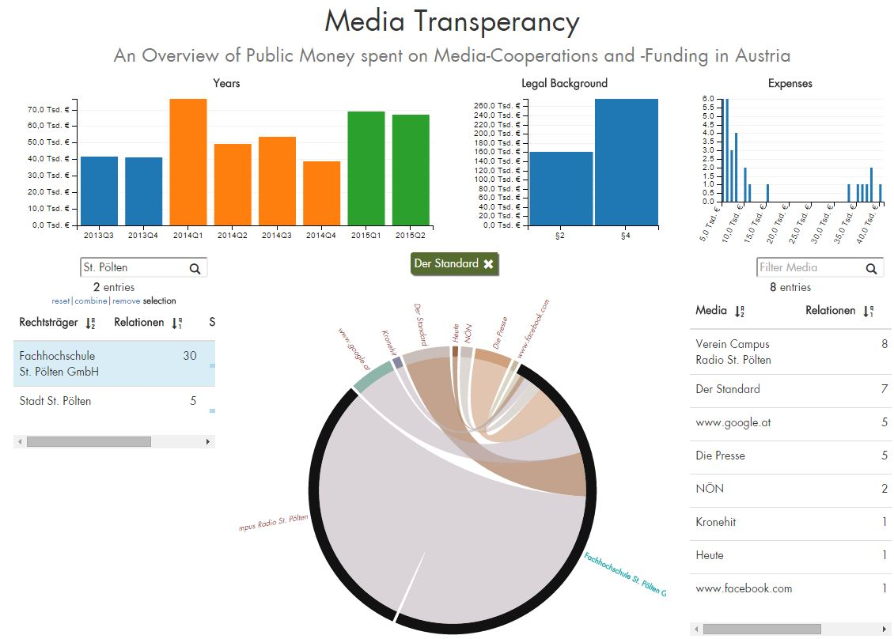
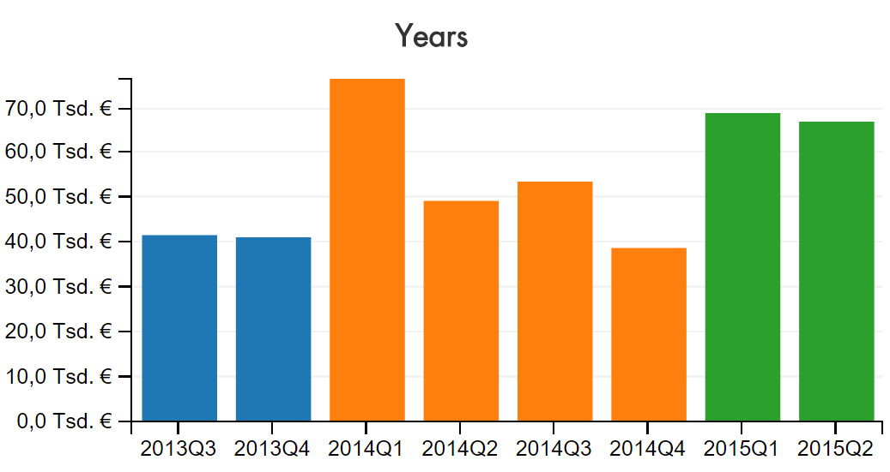
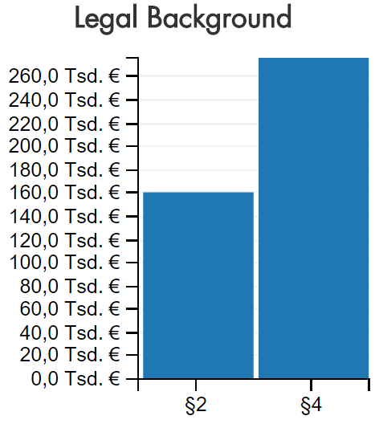
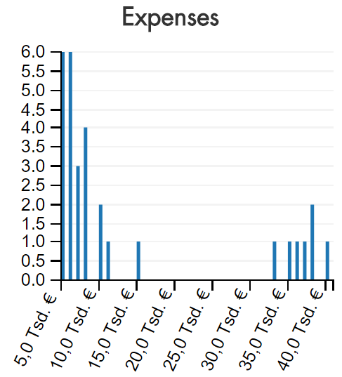
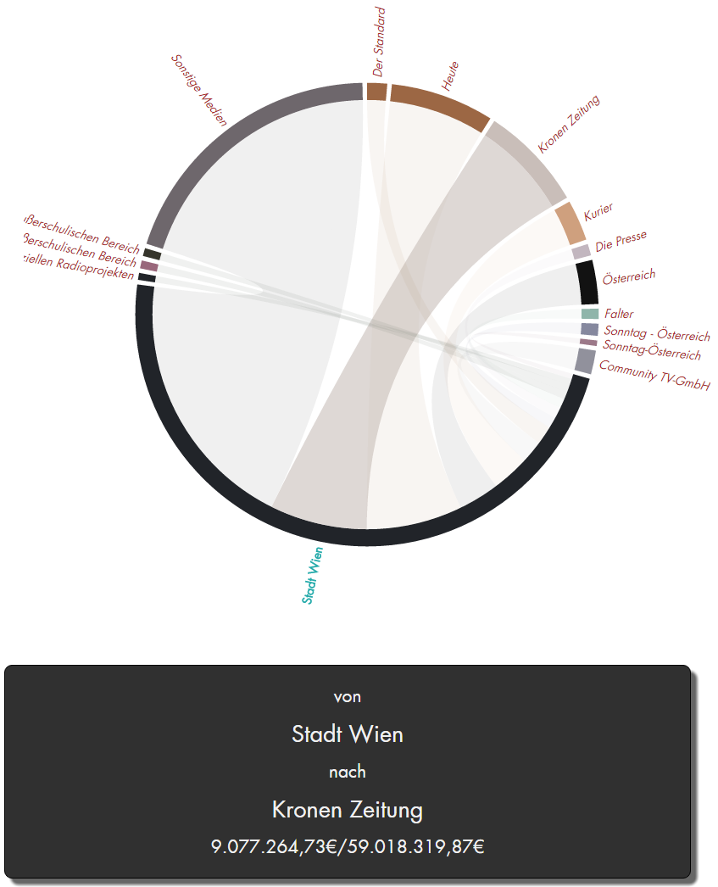

# Media Transparency Database Visualization
<small>188.943 Praktikum aus Visual Computing</small>
    
## Abstract

The "media transparency database" contains the accumulated amount of
money spent by governmental organizations on media companies. This data
can be explored as a multimodal dynamic network. Existing web projects
already present solutions to visualize the dataset, but to analyse the
data further a user needs more interaction methods. I implemented a 
task-tailored dashboard with multiple connected views, which implements
brushing and linking to enable the user to analyse the dataset
in an easy to use matter.

## Related Work

  The "media transparency database" is available since the third quarter 
  of 2012. Since then several visualizations got presented:

  -   [\[F. Lang\]](http://www.paroli-magazin.at/555/) presents a visualization that uses grouping of the media
      entities to reduce the screen space and complexity of
      the visualization. It only uses one quarter of one year of the
      total data. It is possible to interact with the visualization and
      ungroup the media entities.
  -   [\[M. Hametner\]](http://derstandard.at/2000017464403/Regierungsinserate-406-Millionen-im-ersten-Quartal) presents a static visualization with bar charts and a line
      plot as a visualization for time oriented data by the Austrian
      newspaper “Der Standard”.
  -   [\[M. Schrempf\]](http://web.student.tuwien.ac.at/~e0920136/Files/MTDV/src/MTDV.html) 
      implemented a force-directed node link diagram.
      The user of this visualization is able to interact with the data and
      filter it with different queries. But the force-directed node link
      diagram was too slow for the huge database.
  -   [\[P. Salhofer et. al\]](http://www.medien-transparenz.at/) implemented a website to get an overview of the
      media dataset. It features multiple visualizations which are all
      interactive but not connected to one dashboard.

  The first two visualizations are presentations of an analysis of the
  data. But the last two approaches are visualizations that support the
  user to analyze and investigate into the data. The force directed node
  link diagram has the problem that it is too slow to render a nice
  overview of the dynamic network. Additionally it is hard to interpret
  the payment flow, because it is visually encoded in the size of the
  nodes of the diagram. 

  The visualization of [\[P. Salhofer et. al\]](http://www.medien-transparenz.at/) is stable, easy and fast to interact. But
  the visualizations are distributed onto 4 different web pages, which
  makes it hard to combine the insight of the user from one visualization
  with the others. Additionally the payment flow visualization is
  restricted to only 800 relations. 

## Technologies

The following technologies are used:

 * _JavaScript_: a script language to create dynamic client side webpage.
 * _Data-Driven Documents_: A JavaScript library for manipulating documents based on data.
 * [_jQuery_](http://jquery.com/): A fast, small, and feature-rich JavaScript library.
 * [_Bootstrap_](http://getbootstrap.com/): A framework for developing responsive, mobile first projects on the web.
 * [_Brunch_](http://brunch.io/): A [node.js](https://nodejs.org) build tool to compile scripts and styles and to concatenate scripts and styles.
 * _clean-css_: Is a [node.js](https://nodejs.org) library for minifying CSS files.
 * _uglify-js_: Is a [node.js](https://nodejs.org) library for minifying JavaScript files.
 * [_crossfilter_](http://square.github.io/crossfilter/): Is a JavaScript library to explore multivariate datasets with coordinated views.
 * [_DC_](https://dc-js.github.io/dc.js/): Is a JavaScript library with native crossfilter support to create charts for multidimensional data exploration
 * _Git_: Is used as version control system.

## Problem Description

Governmental advertisement in media and sponsorships are a possible way
to influence press opinion. Therefore, the Austrian parliament passed a
law that made it mandatory for governmental organizations to disclose
their expenses for advertisements in different media (TV, radio, print,
as well as online).

This so-called "media transparency database" is made publicly available
by the Austrian Regulatory Authority for Broadcasting and
Telecommunications ([RTR](https://www.rtr.at/de/m/veroeffentl_medkftg_daten)) via the Austrian open government data portal.

It contains the accumulated amount of money transferred in a
certain quarter of the year for each governmental organization and media
company. This database can be explored as a multimodal dynamic network.

### Data Structure

The media transparency database is structured as a Table with each row
containing a relation from one governmental organization
(*Rechtsträger*) to one media company (*Medium*). This
relation contains the amount of transfered money (*Euro*), the quarter
of the year (*Jahr Quartal*) and the law of the reason of the payment
(*Gesetz*).

The table contains over 145000 entries over 12 quarters. So that one
quarter contains 13000 data entries. There are over 1000 governmental
organizations and media companies.

The data quality of the database is not sufficient enough for some data
entries. These entries include spelling mistakes or are just differently
formated.

## Examples

### Dashboard
(Click on the image to go the the video)


[](https://youtu.be/04bdq54m_H8)

### Filters





### Flow Visualization



## Install

1. install [node.js](nodejs.org)
2. install brunch:

```npm install -g brunch```

3. install local packages:

```npm install --save-dev brunch javascript-brunch css-brunch sass-brunch queue-async```

4. install bower

## Run

### develop standard run

```brunch build```

### develop run with server

```brunch watch --server```

The standard port for the brunch server is 3333 (```localhost:3333```)

### release build

```brunch build --production```


